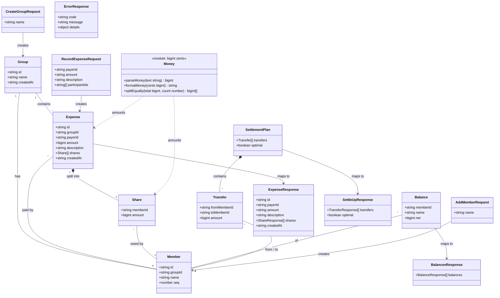

# Splitit — Group Expense Splitting Web API

## Requirements

Implement a small HTTP JSON API that lets a group of people record shared expenses and know, exactly and at any moment, who owes whom — and the fewest payments that would settle everything.

- Create groups and add group-scoped members to them.
- Record expenses (payer, amount, description, participants) that are split equally among the chosen participants, conserving every cent.
- Expose each member's net balance within a group.
- Suggest the provably minimum number of transfers that clears all debts in a group (exact for groups up to 16 non-zero balances; best-effort beyond, and the response says which).
- Guarantee exact money arithmetic end-to-end: no floating point anywhere from request parsing to response formatting.
- Ship with automated unit, property-based, and API-level tests.

Scope boundaries (decisions resolving the analysis' open questions):
- **No authentication**. "Any member can record an expense" means no permission restriction; the expense is attributed to its payer. There is no global User concept — members are names that belong to exactly one group.
- **Single implicit currency** with 2 decimal places (minor unit = cent). No currency field.
- **Create and read only**: no editing/deleting expenses, removing members, or deleting groups.
- **Settle-up is read-only**: it suggests transfers; it does not record settlement payments.
- **In-memory persistence** behind repository interfaces; data does not survive a restart.

## Entities



Entity notes:
- All internal money values are `bigint` minor units (cents). All wire money values are decimal strings (`"12.34"`, `"-3.33"`, `"0.00"`).
- `Member.seq` is a per-group, monotonically increasing insertion index (0, 1, 2, …) used for every deterministic ordering (balances, remainder allocation tie-breaks, settlement).
- `Share` amounts are computed once at record time and stored with the expense (expenses are immutable facts).
- `Balance`, `Transfer`, `SettlementPlan` are derived on read and never stored.

## Approach

1. **API design**:
   - Resource-oriented REST, all group-owned resources nested under `/groups/:groupId`:
     - `POST /groups`, `GET /groups/:groupId`
     - `POST /groups/:groupId/members`, `GET /groups/:groupId/members`
     - `POST /groups/:groupId/expenses`, `GET /groups/:groupId/expenses`
     - `GET /groups/:groupId/balances`
     - `GET /groups/:groupId/settle-up`
   - Money travels as **decimal strings** in both directions; JSON numbers are rejected for amounts so IEEE-754 values never enter the system.
   - Status codes: `201` create, `200` read, `400` malformed input, `404` unknown group (path), `409` duplicate member name, `422` well-formed but business-invalid expense (unknown payer/participant, duplicate participant, non-positive amount).
   - Uniform error body: `{ "error": { "code", "message", "details"? } }`.

2. **Technical implementation**:
   - **TypeScript (strict) on Node.js 24**, ESM modules.
   - **Fastify 5** as HTTP framework: built-in JSON-schema validation (Ajv) and `app.inject()` for fast in-process API tests without opening ports.
   - Ajv configured with `coerceTypes: false` (otherwise Fastify would silently coerce the number `12.5` into the string `"12.5"`), `removeAdditional: false`, and `additionalProperties: false` on every body schema, so malformed input fails loudly.
   - **Vitest** as test runner, **fast-check** for property-based tests of money, balance, and settlement invariants.
   - `buildApp(deps?)` factory creates a fresh Fastify instance with fresh in-memory repositories → every test is isolated; `server.ts` only calls `buildApp().listen()`.
   - **Global exception handling** through a single Fastify `setErrorHandler` (the GlobalExceptionHandler equivalent): maps `AppError` subclasses to their status/code, Fastify validation errors to `400 VALIDATION_ERROR`, and anything else to `500 INTERNAL_ERROR` with a generic message (details logged, never returned).
   - Performance: balances are O(expenses × participants); exact settlement is a subset DP of O(2ⁿ · n) with n ≤ 16 non-zero balances (≈1M steps worst case), greedy O(n log n) beyond.

3. **Business logic**:
   - **Exact money**: `parseMoney` accepts only `^\d{1,10}(\.\d{1,2})?$` and converts to cents with string arithmetic (never `Number()` then multiply). Expense amount must be `> 0` and `≤ 9,999,999,999.99`.
   - **Equal split with conserved remainder**: `base = total / n`, `remainder = total % n`; the first `remainder` participants **in the order submitted in the request** each receive `base + 1`. Shares always sum to the total. Zero shares (e.g., `0.02` among 3 → `0.01, 0.01, 0.00`) are permitted — exact and conserved.
   - **Payer** need not be a participant; a payer-only expense is permitted (no net effect).
   - **Net balance** per member = Σ(amounts paid) − Σ(shares owed). Positive = should receive, negative = should pay. Invariant: Σ balances = 0 exactly.
   - **Minimum transfers**: minimum count = (number of non-zero balances) − (maximum number of disjoint zero-sum subgroups). Compute that partition exactly with a bitmask DP when non-zero balances ≤ 16, then settle each subgroup with largest-debtor→largest-creditor greedy (each subgroup of size m needs exactly m−1 transfers). Above 16, use greedy over the whole set and return `optimal: false`. Every transfer is positive; applying all transfers zeroes every balance.
   - **Determinism**: every ordering tie is broken by `Member.seq`; same data ⇒ byte-identical responses.
   - **Validation strategy**: shape/format at the HTTP schema layer (400); existence and business rules in services (404/409/422).

## Structure

### Inheritance Relationships
1. `AppError` (abstract) extends `Error` — carries `statusCode`, `code`, `message`, optional `details`.
2. `NotFoundError` extends `AppError` — 404, code `GROUP_NOT_FOUND`.
3. `ConflictError` extends `AppError` — 409, code `DUPLICATE_MEMBER_NAME`.
4. `BusinessRuleError` extends `AppError` — 422, codes `UNKNOWN_MEMBER`, `DUPLICATE_PARTICIPANT`, `INVALID_AMOUNT`.
5. `ValidationError` extends `AppError` — 400, code `VALIDATION_ERROR` (used when domain parsing rejects input that passed the schema, e.g. amount format).
6. `GroupRepository`, `MemberRepository`, `ExpenseRepository` interfaces define persistence contracts.
7. `InMemoryGroupRepository`, `InMemoryMemberRepository`, `InMemoryExpenseRepository` implement those interfaces.

### Dependencies
1. `app.ts` (`buildApp`) creates repositories (or receives them), constructs services, registers routes and the error handler.
2. `GroupService` depends on `GroupRepository` and `MemberRepository`.
3. `ExpenseService` depends on `GroupService` (group existence + member lookup) and `ExpenseRepository`; calls `money.parseMoney` and `money.splitEqually`.
4. `SettlementService` depends on `GroupService` and `ExpenseRepository`; calls `balances.computeBalances` and `settlement.suggestTransfers`.
5. Route modules depend only on services and on `http/mappers.ts` / `http/schemas.ts`.
6. Domain modules (`money`, `balances`, `settlement`) depend on nothing but each other's types — no Fastify, no repositories.

### Layered Architecture
1. HTTP Layer (`src/http/`): route registration, JSON schemas, request → service call → response mapping (bigint → decimal string). No business logic.
2. Service Layer (`src/services/`): orchestrates use cases, enforces existence/uniqueness/membership rules, throws `AppError`s.
3. Domain Layer (`src/domain/`): pure functions and types for money, equal splitting, balances, settlement. Fully unit/property tested.
4. Repository Layer (`src/repositories/`): interfaces + in-memory `Map`-backed implementations; returns copies so callers cannot mutate stored state.
5. Exception Handling Layer (`src/http/error-handler.ts`): the single global handler producing the uniform error response.

```
src/
  app.ts                 buildApp(): FastifyInstance
  server.ts              entry point (PORT env, default 3000)
  errors.ts              AppError hierarchy
  domain/
    types.ts             Group, Member, Expense, Share, Balance, Transfer, SettlementPlan
    money.ts             parseMoney, formatMoney, splitEqually
    balances.ts          computeBalances
    settlement.ts        suggestTransfers
  repositories/
    types.ts             repository interfaces
    in-memory.ts         in-memory implementations
  services/
    group-service.ts
    expense-service.ts
    settlement-service.ts
  http/
    schemas.ts           Fastify JSON schemas
    mappers.ts           domain → response DTOs
    error-handler.ts     global error handler
    routes/groups.ts
    routes/members.ts
    routes/expenses.ts
    routes/ledger.ts     balances + settle-up
tests/
  unit/money.test.ts
  unit/balances.test.ts
  unit/settlement.test.ts
  api/groups.test.ts
  api/expenses.test.ts
  api/ledger.test.ts
```

## Operations

### Task 1: Bootstrap project
1. Responsibility: create a runnable, testable TypeScript project.
2. Files:
   - `package.json`: `"type": "module"`, `"engines": { "node": ">=22" }`; dependencies `fastify@^5`; devDependencies `typescript@^5`, `tsx`, `vitest`, `fast-check`, `@types/node`.
   - Scripts: `"dev": "tsx watch src/server.ts"`, `"build": "tsc -p tsconfig.json"`, `"start": "node dist/server.js"`, `"test": "vitest run"`, `"typecheck": "tsc --noEmit"`.
   - `tsconfig.json`: `strict: true`, `target: ES2022`, `module`/`moduleResolution: NodeNext`, `outDir: dist`, `rootDir: src`, `include: ["src"]`, `noUncheckedIndexedAccess: true`.
   - `vitest.config.ts`: `test.include: ["tests/**/*.test.ts"]`.
   - `.gitignore`: `node_modules`, `dist`.
3. Completion: `npm install`, `npm run typecheck`, `npm test` (no tests yet → passes with zero/none) all run.

### Task 2: Create Errors - `src/errors.ts`
1. Responsibility: typed error hierarchy mapped one-to-one to HTTP responses.
2. Classes:
   - `abstract class AppError extends Error` with `readonly statusCode: number`, `readonly code: string`, `readonly details?: Record<string, unknown>`; constructor `(message: string, details?)`, sets `this.name = new.target.name`.
   - `ValidationError` → 400, `VALIDATION_ERROR`.
   - `NotFoundError` → 404, constructor `(code: 'GROUP_NOT_FOUND', message, details?)`.
   - `ConflictError` → 409, `DUPLICATE_MEMBER_NAME`.
   - `BusinessRuleError` → 422, constructor `(code: 'UNKNOWN_MEMBER' | 'DUPLICATE_PARTICIPANT' | 'INVALID_AMOUNT', message, details?)`.
3. Usage scenarios: thrown by domain parsing (`ValidationError`, `BusinessRuleError`) and services; never thrown for programmer errors (those surface as 500).

### Task 3: Create Domain Types - `src/domain/types.ts`
1. `interface Group { id: string; name: string; createdAt: string }`
2. `interface Member { id: string; groupId: string; name: string; seq: number }`
3. `interface Share { memberId: string; amount: bigint }`
4. `interface Expense { id: string; groupId: string; payerId: string; amount: bigint; description: string; shares: Share[]; createdAt: string }`
5. `interface Balance { memberId: string; net: bigint }`
6. `interface Transfer { fromMemberId: string; toMemberId: string; amount: bigint }`
7. `interface SettlementPlan { transfers: Transfer[]; optimal: boolean }`

### Task 4: Implement Money - `src/domain/money.ts`
1. Constants: `MAX_AMOUNT_CENTS = 999_999_999_999n` (9,999,999,999.99).
2. `parseMoney(text: string): bigint`
   - Logic:
     - Must match `/^(\d{1,10})(?:\.(\d{1,2}))?$/`; otherwise throw `ValidationError('amount must be a decimal string with at most 2 decimal places', { amount: text })`.
     - `units = BigInt(intPart)`, `fraction = (fracPart ?? '').padEnd(2, '0')`, `cents = units * 100n + BigInt(fraction)`.
     - Never uses `Number`, `parseFloat`, or `*` on non-bigint values.
   - Returns cents (may be `0n`; positivity is a business rule checked by the caller).
3. `formatMoney(cents: bigint): string`
   - Logic: `sign = cents < 0n ? '-' : ''`, `abs = cents < 0n ? -cents : cents`, return `` `${sign}${abs / 100n}.${(abs % 100n).toString().padStart(2, '0')}` ``. `0n` → `"0.00"` (never `"-0.00"`).
4. `splitEqually(total: bigint, count: number): bigint[]`
   - Preconditions: `total >= 0n`, `Number.isInteger(count) && count >= 1`; violations throw `RangeError` (programmer error).
   - Logic: `n = BigInt(count)`, `base = total / n`, `remainder = Number(total % n)`; return array of length `count` where index `i < remainder` gets `base + 1n`, else `base`.
   - Postcondition: sum equals `total`; max − min ≤ 1 cent.

### Task 5: Implement Balances - `src/domain/balances.ts`
1. `computeBalances(members: Member[], expenses: Expense[]): Balance[]`
   - Logic:
     - Initialize `Map<memberId, bigint>` with `0n` for every member (members with no activity appear with `0n`).
     - For each expense: `net[payerId] += amount`; for each share: `net[share.memberId] -= share.amount`.
     - Return balances ordered by `member.seq` ascending.
   - Invariant: Σ net = `0n` (asserted in tests, not at runtime).

### Task 6: Implement Settlement - `src/domain/settlement.ts`
1. Constant: `MAX_EXACT_PARTICIPANTS = 16`.
2. `suggestTransfers(balances: Balance[]): SettlementPlan`
   - Input order is treated as the canonical tie-break order (callers pass balances in `seq` order).
   - Logic:
     - `nonZero = balances.filter(b => b.net !== 0n)` (keep order). If empty → `{ transfers: [], optimal: true }`.
     - If `nonZero.length > MAX_EXACT_PARTICIPANTS` → `{ transfers: greedySettle(nonZero), optimal: false }`.
     - Else `groups = partitionIntoZeroSumGroups(nonZero)`; `transfers = groups.flatMap(greedySettle)`; return `{ transfers, optimal: true }`.
3. `partitionIntoZeroSumGroups(items: Balance[]): Balance[][]` (internal, exported for tests)
   - Logic (bitmask DP, n = items.length, full = (1 << n) − 1):
     - `sum[mask]`: bigint, computed incrementally `sum[mask] = sum[mask & (mask − 1)] + items[lowestBit(mask)].net`.
     - `dp[0] = 0`; for `mask` 1..full: `dp[mask] = max over set bits i of dp[mask ^ (1 << i)]` plus `1` if `sum[mask] === 0n`; record `choice[mask] = i` for the first (lowest) `i` achieving the max.
     - Reconstruct: `mask = full`, `bucket = []`; while `mask !== 0`: `i = choice[mask]`, `bucket.push(i)`, `mask ^= 1 << i`; if `sum[mask] === 0n` (true for the empty mask too) → emit `bucket` as one group and reset `bucket = []`. Every emitted bucket sums to zero and the number of buckets equals `dp[full]`.
     - Return groups with members in ascending original index, groups ordered by their smallest index.
   - Result: maximum number of disjoint zero-sum subgroups covering all items; each subgroup has no further zero-sum split that would reduce transfers.
4. `greedySettle(items: Balance[]): Transfer[]` (internal, exported for tests)
   - Logic:
     - `creditors` = copies with net > 0, `debtors` = copies with net < 0 (amount as positive owed).
     - Loop while both non-empty: pick creditor with largest remaining amount and debtor with largest remaining owed (ties → earliest in input order); `amount = min(creditRemaining, debtRemaining)`; push `{ fromMemberId: debtor, toMemberId: creditor, amount }`; subtract; remove any party that reaches `0n`.
     - Each iteration zeroes at least one party ⇒ at most (items − 1) transfers; on a zero-sum subgroup with no zero-sum proper subset, exactly items − 1.
   - Guarantees: every transfer `amount > 0n`; applying all transfers zeroes every balance (if input sums to zero).

### Task 7: Implement Repositories - `src/repositories/types.ts`, `src/repositories/in-memory.ts`
1. Interfaces:
   - `GroupRepository { save(group: Group): void; findById(id: string): Group | undefined }`
   - `MemberRepository { save(member: Member): void; findByGroup(groupId: string): Member[]; countByGroup(groupId: string): number }`
   - `ExpenseRepository { save(expense: Expense): void; findByGroup(groupId: string): Expense[] }`
2. In-memory implementations:
   - Backed by `Map<string, Group>`, `Map<groupId, Member[]>`, `Map<groupId, Expense[]>`.
   - `find*` return shallow copies (`structuredClone` for expenses so shares arrays aren't shared); lists returned in insertion order.
3. Concurrency: single-threaded event loop; every service write is synchronous between validation and save, so no interleaving can violate invariants.

### Task 8: Implement Service - `src/services/group-service.ts`
1. Constructor: `(groups: GroupRepository, members: MemberRepository)`.
2. `createGroup(name: string): Group` — `id = randomUUID()`, `name = name.trim()`, `createdAt = new Date().toISOString()`; save; return.
3. `getGroup(groupId: string): Group` — throw `NotFoundError('GROUP_NOT_FOUND', 'Group not found', { groupId })` if missing.
4. `addMember(groupId: string, name: string): Member`
   - `getGroup(groupId)`; `trimmed = name.trim()`.
   - If any existing member's name equals `trimmed` case-insensitively (`toLocaleLowerCase('en')`) → `ConflictError('A member with this name already exists in the group', { name: trimmed })`.
   - `seq = members.countByGroup(groupId)`; create with `randomUUID()`; save; return.
5. `listMembers(groupId: string): Member[]` — `getGroup` then `findByGroup` (seq order).

### Task 9: Implement Service - `src/services/expense-service.ts`
1. Constructor: `(groupService: GroupService, expenses: ExpenseRepository)`.
2. `recordExpense(groupId: string, input: { payerId: string; amount: string; description: string; participantIds: string[] }): Expense`
   - Input validation:
     - `groupService.getGroup(groupId)` (404).
     - `amount = parseMoney(input.amount)` (400 on format). If `amount === 0n` or `amount > MAX_AMOUNT_CENTS` → `BusinessRuleError('INVALID_AMOUNT', 'amount must be greater than 0.00 and at most 9999999999.99')`.
     - `memberIds = new Set(listMembers(groupId).map(m => m.id))`.
     - `payerId` not in `memberIds` → `BusinessRuleError('UNKNOWN_MEMBER', 'Payer is not a member of this group', { memberId })`.
     - Duplicates in `participantIds` → `BusinessRuleError('DUPLICATE_PARTICIPANT', 'Participant is listed more than once', { memberId: firstDuplicate })`.
     - Any participant not in `memberIds` → `BusinessRuleError('UNKNOWN_MEMBER', 'Participant is not a member of this group', { memberId })`.
   - Business logic: `amounts = splitEqually(amount, participantIds.length)`; `shares = participantIds.map((id, i) => ({ memberId: id, amount: amounts[i] }))` (request order preserved ⇒ remainder cents go to the first-listed participants).
   - Build `Expense` (`randomUUID()`, `description.trim()`, ISO `createdAt`), save, return.
3. `listExpenses(groupId: string): Expense[]` — `getGroup` then `findByGroup` (insertion order).

### Task 10: Implement Service - `src/services/settlement-service.ts`
1. Constructor: `(groupService: GroupService, expenses: ExpenseRepository)`.
2. `getBalances(groupId: string): Array<Balance & { name: string }>` — `members = groupService.listMembers(groupId)`; `computeBalances(members, expenses.findByGroup(groupId))`; attach `name`.
3. `getSettlement(groupId: string): SettlementPlan` — `suggestTransfers(computeBalances(...))` (balances already in seq order).

### Task 11: Create HTTP Schemas and Mappers - `src/http/schemas.ts`, `src/http/mappers.ts`
1. Schemas (all bodies `type: object`, `additionalProperties: false`, all listed properties required):
   - `createGroupBody`: `name: string, minLength 1, maxLength 100, pattern "\\S"`.
   - `addMemberBody`: same as above.
   - `recordExpenseBody`: `payerId: string minLength 1`; `amount: string, pattern "^\\d{1,10}(\\.\\d{1,2})?$"`; `description: string minLength 1 maxLength 200 pattern "\\S"`; `participantIds: array, minItems 1, maxItems 100, items string minLength 1`.
   - `groupIdParams`: `groupId: string`.
2. Mappers:
   - `toGroupResponse(group, members)` → `{ id, name, createdAt, members: [{ id, name }] }`.
   - `toMemberResponse(m)` → `{ id, name }`.
   - `toExpenseResponse(e)` → `{ id, payerId, amount: formatMoney(e.amount), description, shares: [{ memberId, amount: formatMoney }], createdAt }`.
   - `toBalancesResponse(list)` → `{ balances: [{ memberId, name, net: formatMoney(net) }] }`.
   - `toSettleUpResponse(plan, membersById)` → `{ transfers: [{ from: { id, name }, to: { id, name }, amount: formatMoney }], optimal }`.
   - Mappers are the only place bigint becomes string; no bigint ever reaches `JSON.stringify`.

### Task 12: Create Exception Handler - `src/http/error-handler.ts`
1. Responsibility: unified handling of all errors via `app.setErrorHandler(errorHandler)`.
2. Logic:
   - `error instanceof AppError` → `reply.status(error.statusCode).send({ error: { code, message, details } })` (omit `details` when undefined).
   - Fastify validation error (`error.validation` present) → 400 `{ code: 'VALIDATION_ERROR', message: error.message }`.
   - Malformed JSON / unsupported content type (Fastify `statusCode` 400/415 with `FST_ERR_CTP_*` codes) → same status, code `VALIDATION_ERROR` or `UNSUPPORTED_MEDIA_TYPE`.
   - Otherwise → `request.log.error(error)` and 500 `{ code: 'INTERNAL_ERROR', message: 'Internal server error' }`.
3. Also `app.setNotFoundHandler` → 404 `{ code: 'ROUTE_NOT_FOUND', message: 'Route not found' }`.

### Task 13: Create Routes - `src/http/routes/*.ts`
Each module exports a Fastify plugin `(app, { services })`.
1. `groups.ts`
   - `POST /groups` (body `createGroupBody`) → 201 `toGroupResponse(group, [])`.
   - `GET /groups/:groupId` → 200 `toGroupResponse(group, members)`.
2. `members.ts`
   - `POST /groups/:groupId/members` (body `addMemberBody`) → 201 `toMemberResponse`.
   - `GET /groups/:groupId/members` → 200 `{ members: [...] }` in seq order.
3. `expenses.ts`
   - `POST /groups/:groupId/expenses` (body `recordExpenseBody`) → 201 `toExpenseResponse`.
   - `GET /groups/:groupId/expenses` → 200 `{ expenses: [...] }` in insertion order.
4. `ledger.ts`
   - `GET /groups/:groupId/balances` → 200 `toBalancesResponse`.
   - `GET /groups/:groupId/settle-up` → 200 `toSettleUpResponse`.

### Task 14: Create App Factory and Server - `src/app.ts`, `src/server.ts`
1. `buildApp(options?: { logger?: boolean }): FastifyInstance`
   - `Fastify({ logger: options?.logger ?? false, ajv: { customOptions: { coerceTypes: false, removeAdditional: false, allErrors: false } } })`.
   - Instantiate in-memory repositories and services; register error/not-found handlers and the four route plugins.
2. `server.ts`: `const app = buildApp({ logger: true }); await app.listen({ port: Number(process.env.PORT ?? 3000), host: '0.0.0.0' })`; exit(1) on listen failure.

### Task 15: Write Unit and Property Tests - `tests/unit/`
1. `money.test.ts`
   - `parseMoney`: `"0"`→0n, `"12"`→1200n, `"12.3"`→1230n, `"12.34"`→1234n, `"0.01"`→1n, `"9999999999.99"`→999999999999n; rejects `"1.005"`, `"-1"`, `"1e3"`, `".5"`, `"5."`, `" 5"`, `""`, `"1,00"`, 11-digit integer part.
   - `formatMoney`: `0n`→`"0.00"`, `5n`→`"0.05"`, `-333n`→`"-3.33"`, `100000n`→`"1000.00"`.
   - Round-trip property: for any cents 0..MAX, `parseMoney(formatMoney(c)) === c`.
   - `splitEqually`: `(1000n, 3)` → `[334n, 333n, 333n]`; `(2n, 3)` → `[1n, 1n, 0n]`; `(0n, 1)`→`[0n]`; property: sum = total, length = count, max − min ≤ 1n, non-increasing order.
2. `balances.test.ts`
   - Payer not participating gets +amount; payer-only expense is net zero; members without activity → 0n; result ordered by seq.
   - Property: random members/expenses → Σ net = 0n.
3. `settlement.test.ts`
   - Empty / all-zero → no transfers, `optimal: true`.
   - `{+5, −5}` → one transfer of 5 from debtor to creditor.
   - `{+6, +4, +3, −7, −6}` → exactly 3 transfers (greedy alone gives 4 — assert `greedySettle` yields 4 to document the difference).
   - Property (n ≤ 8 random zero-sum balances): applying transfers zeroes all balances; every amount > 0; transfer count equals brute-force minimum (n − max zero-sum partition count via exhaustive search in the test).
   - 17 non-zero balances → `optimal: false`, still zeroes all balances, ≤ 16 transfers.
   - Performance: 16 distinct non-zero balances complete in < 1 s.
   - Determinism: same input twice → deep-equal output.

### Task 16: Write API Tests - `tests/api/`
Using `buildApp()` per test and `app.inject()`.
1. `groups.test.ts`: create group 201; blank/missing name 400; extra property 400; unknown group 404 `GROUP_NOT_FOUND`; add member 201; duplicate name (case-insensitive) 409; list members in order; unknown route 404.
2. `expenses.test.ts`: record `"10.00"` among 3 → shares `"3.34","3.33","3.33"`; amount as JSON number `10` → 400; `"1.005"` → 400; `"0.00"` → 422 `INVALID_AMOUNT`; unknown payer → 422 `UNKNOWN_MEMBER`; member from another group → 422 `UNKNOWN_MEMBER`; duplicate participant → 422 `DUPLICATE_PARTICIPANT`; empty participants → 400; list expenses in insertion order.
3. `ledger.test.ts`:
   - End-to-end scenario: A pays `"90.00"` for A,B,C; B pays `"30.00"` for B,C → balances A `"60.00"`, B `"-15.00"`, C `"-45.00"`; settle-up → two transfers C→A `"45.00"` then B→A `"15.00"`, `optimal: true`.
   - Classic float trap: three expenses of `"0.10"` and `"0.20"` → balances are exact (e.g., `"0.30"` not `"0.30000000000000004"`).
   - Group with members but no expenses → all `"0.00"`, settle-up `[]`.
   - Balances sum to zero (parse strings back to cents in the test).
   - Unknown group → 404 on both endpoints.

## Norms

1. **Module & typing standards**: TypeScript `strict`, no `any` (use `unknown` + narrowing); ESM with explicit `.js` import suffixes (NodeNext); one concept per file; named exports only.
2. **Dependency injection**: constructor injection of repository interfaces into services; `buildApp` is the composition root; tests construct fresh apps — no module-level singletons or mutable globals.
3. **Exception handling**:
   - All expected failures are `AppError` subclasses with a stable `code` (SCREAMING_SNAKE_CASE) and a human-readable `message`; optional `details` holds only client-supplied identifiers/values.
   - Classify by domain: `ValidationError` (format), `NotFoundError` (resources), `ConflictError` (uniqueness), `BusinessRuleError` (expense rules).
   - Services throw; routes never catch; the global error handler is the only place errors become responses.
   - Unified error response: `{ "error": { "code": string, "message": string, "details"?: object } }`.
   - Unexpected errors are logged with request context and returned as generic 500.
4. **Money handling**:
   - Internal money is always `bigint` cents; wire money is always a decimal string with exactly 2 decimals on output.
   - Forbidden in money paths: `number`, `parseFloat`, `Number(amount)`, `toFixed`, `Math.round`, division on floats.
   - Conversion happens only in `parseMoney` (in) and `formatMoney` (out, via mappers).
5. **Data validation**: shape/format via Fastify JSON schemas (`additionalProperties: false`, no type coercion); semantic rules in services; trim names/descriptions before storing.
6. **Determinism**: every list response has a defined order (seq for members/balances, insertion for expenses, algorithm order for transfers); ties broken by `seq`.
7. **Logging**: Fastify's pino logger enabled in `server.ts`, disabled in tests; log 5xx errors at `error`; never log full request bodies.
8. **Testing**: Vitest; domain logic covered by example-based + fast-check property tests; every endpoint and every error code covered by at least one `inject()` test; tests independent and order-agnostic.
9. **Documentation**: short JSDoc on every exported domain function stating invariants (e.g., "shares sum exactly to total"); README section with endpoints and example requests.

## Safeguards

1. **Functional constraints**:
   - Shares of every expense sum exactly to its amount; per-expense share spread ≤ 0.01.
   - Σ of all balances in a group is exactly `0.00`.
   - Applying all suggested transfers results in every balance being exactly `0.00`; every transfer amount > `0.00`; no transfer from a member to themselves.
   - When `optimal: true`, transfer count equals the true minimum (non-zero balances − maximum zero-sum partition count).
2. **Performance constraints**:
   - Settle-up with ≤ 16 non-zero balances completes in < 1 s; beyond 16 uses greedy (O(n log n)–O(n²)) and returns `optimal: false`.
   - Balance computation is linear in total shares; no caching layer required.
   - Max 100 participants per expense (schema-enforced).
3. **Security constraints**:
   - No authentication by design (documented); API must not be exposed publicly without an auth layer.
   - Error responses never include stack traces, internal paths, or raw exception messages for 5xx.
   - Body size limited to Fastify default (1 MiB); unknown body properties rejected.
4. **Integration constraints**:
   - Node.js ≥ 22 (developed on 24); no native dependencies; no external services or databases.
   - Content type `application/json` only.
5. **Business rule constraints**:
   - Expense amount: `0.01 ≤ amount ≤ 9999999999.99`, ≤ 2 decimal places.
   - Payer and every participant must be existing members of the same group; participants unique; at least 1 participant.
   - Payer may or may not be a participant; zero-valued shares allowed when amount < participant count (in cents).
   - Remainder cents go to the first `remainder` participants in request order.
   - Member names unique per group, case-insensitive after trimming; 1–100 chars. Group names 1–100 chars. Descriptions 1–200 chars.
6. **Exception handling constraints**:
   - Every business exception has a stable error code and clear message: `VALIDATION_ERROR` (400), `GROUP_NOT_FOUND` (404), `ROUTE_NOT_FOUND` (404), `DUPLICATE_MEMBER_NAME` (409), `UNKNOWN_MEMBER` / `DUPLICATE_PARTICIPANT` / `INVALID_AMOUNT` (422), `INTERNAL_ERROR` (500).
   - Exceptions classified by domain per the hierarchy in Structure.
   - Exception information must not expose internal system details.
   - All errors flow through the single global error handler.
7. **Technical constraints**:
   - No floating-point arithmetic anywhere in money paths (reviewable by grep: no `parseFloat`/`toFixed`/`Number(` on amounts).
   - Ajv `coerceTypes: false` must remain set — a JSON number for `amount` must yield 400.
   - Domain modules must not import Fastify or repositories.
   - Expenses are immutable once stored; repositories return copies.
8. **Data constraints**:
   - IDs are UUID v4 strings from `crypto.randomUUID()`.
   - Timestamps ISO-8601 UTC strings.
   - Money output format: `^-?\d+\.\d{2}$`; never `"-0.00"`.
9. **API constraints**:
   - Endpoints exactly as listed in Approach §1; `201` for creation, `200` for reads.
   - Response shapes exactly as defined by the mappers in Task 11; list endpoints wrap arrays in a named property (`members`, `expenses`, `balances`, `transfers`).
   - Settle-up response always includes `optimal: boolean`.
